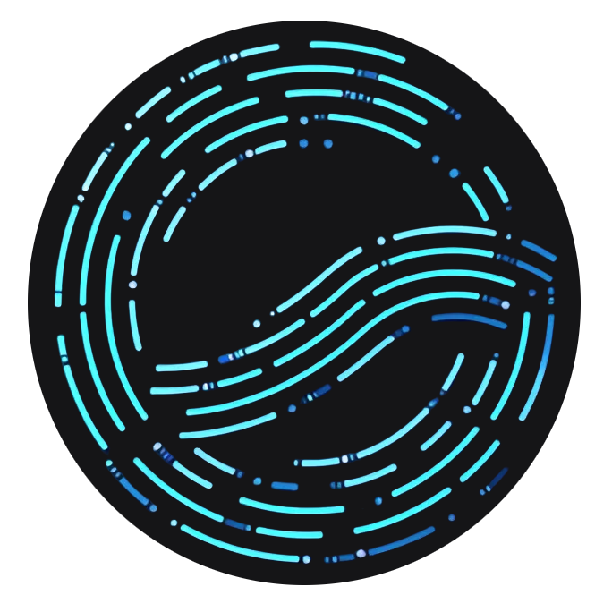
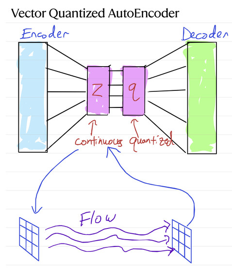

<p align="center">
  
</p>

# Flocoder

This is a (Work In Progress!) teaching and research package for exploring latent generative flow matching models. (The name is inspired by "vocoder.")

This project initially started as a way to provide a lightweight, fast (and interpretable?) upgrade to the diffusion model system [Pictures of MIDI](https://huggingface.co/spaces/drscotthawley/PicturesOfMIDI) for MIDI piano roll images, but `flocoder` designed to work on more general datasets too. 

## Quickstart

Head over to [`notebooks/SD_Flower_Flow.ipynb`](https://github.com/drscotthawley/flocoder/blob/main/notebooks/SD_Flower_Flow.ipynb) and run through it for a taste. It will run on Colab. 

## Overview

Check out the sets of slides linked to on [`notebooks/README.md`](https://github.com/drscotthawley/flocoder/blob/main/notebooks/README.md).

## Architecture Overview



The above diagram illustrates the architecture of our intended model: a VQVAE compresses MIDI data into a discrete latent space, while a flow model learns to generate new samples in the continuous latent space.  But we can also flow in the continuous space of a VAE like the one for Stable Diffusion. 

## Installation

```bash
# Clone the repository
git clone https://github.com/drscotthawley/flocoder.git
cd flocoder

# Install uv if not already installed
# On macOS/Linux:
# curl -LsSf https://astral.sh/uv/install.sh | sh
# On Windows PowerShell:
# irm https://astral.sh/uv/install.ps1 | iex

# Create a virtual environment with uv, specifying Python 3.10
uv venv --python=python3.10

# Activate the virtual environment
# On Linux/macOS:
source .venv/bin/activate
# On Windows:
# .venv\Scripts\activate

# Install the package in editable mode (See below re. NATTEN errors)
uv pip install -e .

# Recommended: Install development dependencies (jupyter, others...)
uv pip install -e ".[dev]"

# Recommended: install NATTEN separately with special flags
uv pip install natten --no-build-isolation
# if that fails, see NATTEN's install instructions (https://github.com/SHI-Labs/NATTEN/blob/main/docs/install.md)
# and specify exact version number, e.g.
# uv pip install natten==0.17.3+torch250cu124 -f https://shi-labs.com/natten/wheels/
# or build fromt the top of the source, e.g.:
# uv pip install --no-build-isolation git+https://github.com/SHI-Labs/NATTEN
```

## Project Structure

The project is organized as follows:

- `src/flocoder/`: Main package code
  - `models/`: Neural network model definitions (VQVAE, UNet)
  - `data/`: Data loading and processing utilities
  - `training/`: Training logic and utilities
  - `utils/`: General utilities and helper functions
- `scripts/`: Training and evaluation scripts
- `configs/`: Configuration files for models and training
- `notebooks/`: Jupyter notebooks for tutorials and examples
- `tests/`: Unit tests


## Training

The package includes several training scripts located in the `scripts/` directory:

### Optional Training a VQGAN
You can use use the Stable Diffusion VAE to get started quickly. (It will auto-download).
But if you want to train your own...

```bash
export CONFIG_FILE=configs/flowers_config.yaml 
#export CONFIG_FILE=configs/midi_config.yaml 
./train_vqgan.py --config $CONFIG_FILE
```

The VQVAE compresses MIDI piano roll images into a quantized latent representation.
This will save checkpoints in the `checkpoints/` directory. Use that checkpoint to pre-encode your data like so... 

### Pre-Encoding Data (with frozen augmentations)
Takes about 15 minutes to run on a single GPU.
```bash
./preencode_data.py --config $CONFIG_FILE
```

### Training the Flow Model

```bash
./train_flow.py --config $CONFIG_FILE
```

The flow model operates in the latent space created by the VQVAE encoder.

### Generating Samples -- TODO: this is not implemented yet! 

```bash
# Generate new MIDI samples
./generate_samples.py --checkpoint models/flow_checkpoint.pt --output samples/
```

This generates new samples by sampling from the flow model and decoding through the VQVAE.

# Contributing

Contributions are welcome!  Still getting this properly "set up" to welcome more people. (We'll have Contribitors Guidelines eventually.) For now, check the if you think something needs doing, it probably does!  Please review the [Style Guide](StyleGuide.md) and submit a Pull Request!  

# TODO

- [x] Add Discussions area
- [ ] Fix "code smell" throughout -- repeated methods, hard-coded values, etc. This was written quickly. 
- [ ] Contributor Guidelines
- [x] Style Guide
- [ ] Standalone sampler script
- [ ] In training/elsewhere: rename "vae"/"vqvae"/"vqgan" (lowercase only) variable as just "autoencoder"
- [ ] Documentation
- [ ] Move custom config/CLI arg system to Hydra or other package
- [ ] Improve overall introduction/orientation


# Acknowledgement

This project is generously supported by Hyperstate Music AI.

# License

This project is licensed under the terms of the MIT license.
